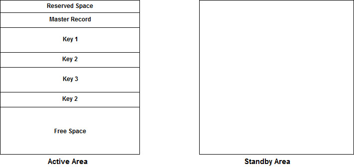
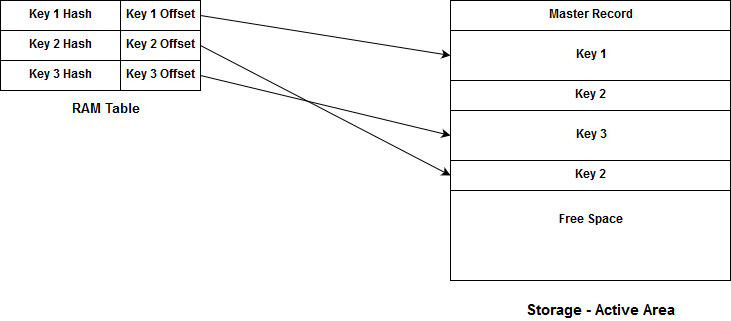
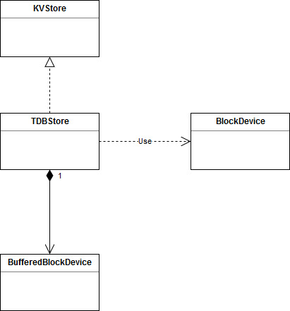

# TDBStore
- [Introduction](#introduction)
    + [Overview and background](#overview-and-background)
    + [Requirements and assumptions](#requirements-and-assumptions)
- [System architecture and high-level design](#system-architecture-and-high-level-design)
  * [Design basics](#design-basics)
    + [Sequential writes](#sequential-writes)
    + [Memory layout and areas](#memory-layout-and-areas)
    + [Garbage collection](#garbage-collection)
    + [RAM Table](#ram-table)
    + [Underlying storage](#underlying-storage)

# Introduction

### Overview and background

Tiny Database Storage (TDBStore) is a lightweight module that stores data on an underlying BlockDevice. It is part of of the KVStore class family, meaning it supports the get/set interface. It is designed to optimize performance (speed of access), reduce wearing of the flash and minimize storage overhead. It is also resilient to power failures.

### Requirements and assumptions

TDBStore assumes the underlying block device is fully dedicated to it (starting offset 0).

# System architecture and high-level design

## Design basics

TDBStore includes the following design basics:
- Sequential writes: TDBStore performs all writes sequentially on the physical storage as records, superseding the previous ones for the same key.
- Memory layout - areas: TDBStore divides the physical storage equally into two areas - active and standby. All writes are made to the end of the active area's free space. When the active area is exhausted, a garbage collection process is invoked, copying only the up to date values of all keys to the standby area, and turning it active.
- RAM table: Indexes all keys in RAM, thus allowing fast access to their records in the physical storage.

### Sequential writes

All writes occur sequentially on the physical storage as records, superseding the previous ones for the same key. Each data record is written right after the last written one. If a key is updated, a new record with this key is written, overriding the previous value of this key. If a key is deleted, a new record with a "deleted" flag is added.

Writes expect the storage to be erased. However, TDBStore takes the "erase as you go" approach, meaning that when it crosses a sector boundary, it checks whether the next sector is erased. If not, it erases the next sector. This saves time during initialization and garbage collection.

### Memory layout and areas

Each key is stored in a separate record on the active area. The first record in the area is the master record. Its main purpose is to hold an area version, protecting you against a case in which there are two valid areas. (This can happen in the extreme cases of power failures.)

A 24-byte header precedes a record key and data. Fields are:

- Magic: a constant value, for quick validity checking.
- Header size: size of header.
- Revision: TDBStore revision (currently 1).
- User flags: Flags received from user. Currently only write once is dealt with (others are ignored).
- Internal flags: Internal TDBStore flags (currently only includes deleted flag).
- Key size: size of key.
- Data size: size of data.
- CRC: a 32-bit CRC, calculated on header (except CRC), key and data.
- Programming size pad: padding to the storage programming size.

### Garbage collection

Garbage collection (GC) is the process of compacting the records stored in the active area to the standby one, by copying only the most recent values of all the keys (without the ones marked as deleted). Then, the standby area becomes the active one and the previously active area is erased (not fully, only its first sector).

GC is invoked in the following cases:

- When the active area is exhausted.
- During initialization, when a corruption is found while scanning the active area. In this case, GC is performed up to the record preceding the corruption.

### Reserved space

The active area includes a fixed and small reserved space. This space is used for a quick storage and extraction of a write-once data (such as the device key). Its size is 64 bytes, aligned up to the underlying block device. Once it is written, nothing can modify it. It is also copied between the areas during garbage collection process.

### RAM table

All keys are indexed in memory using a RAM table. Key names are represented by a 32-bit hash. The table includes the hash (and sorted by it) and the offset to the key record in the block device. This allows both fast searching in the table and a low memory footprint. To keep code simple, the same CRC function used for recored validation is used for hash calculation (because TLS hash calculation is too heavy).

Key names may produce duplicate hash values. This is OK because the hash is only used for fast access to the key, and the key needs to be verified when accessing the storage. If the key doesn't match, move to the next duplicate in the table.

### Underlying storage

TDBStore fully implements the KVStore interface over a BlockDevice. Due to the fact it may write to the block device in program units that may not match the underlying device program_size, it uses a `BufferedBlockDevice` to cache writes. This helps reduce wear on underlying flash.

Functionality, as defined by KVStore, includes the following:

- Initialization and reset.
- Core actions: get, set and remove.
- Incremental set actions.
- Iterator actions.
