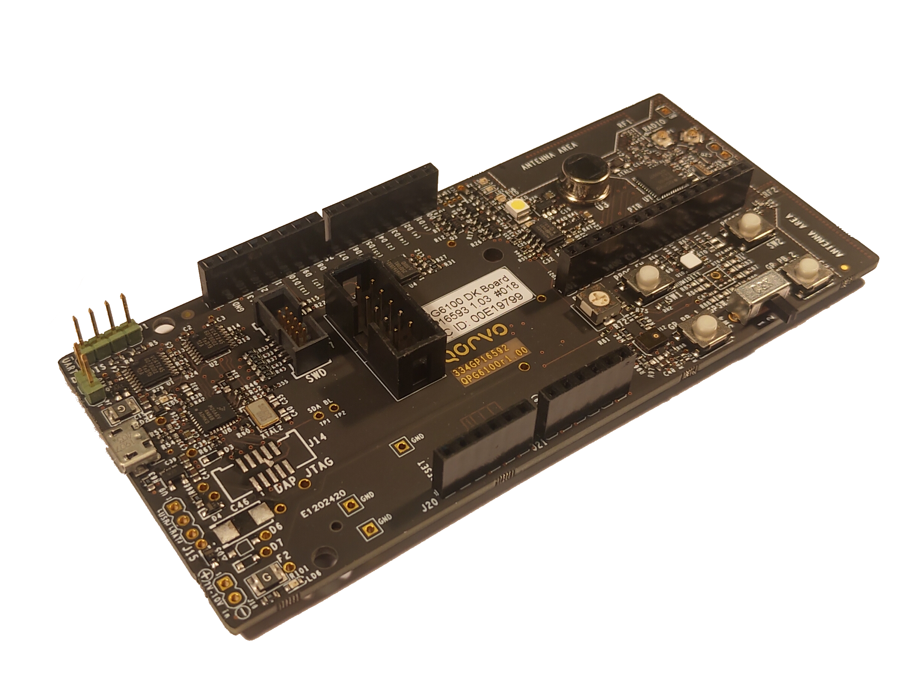
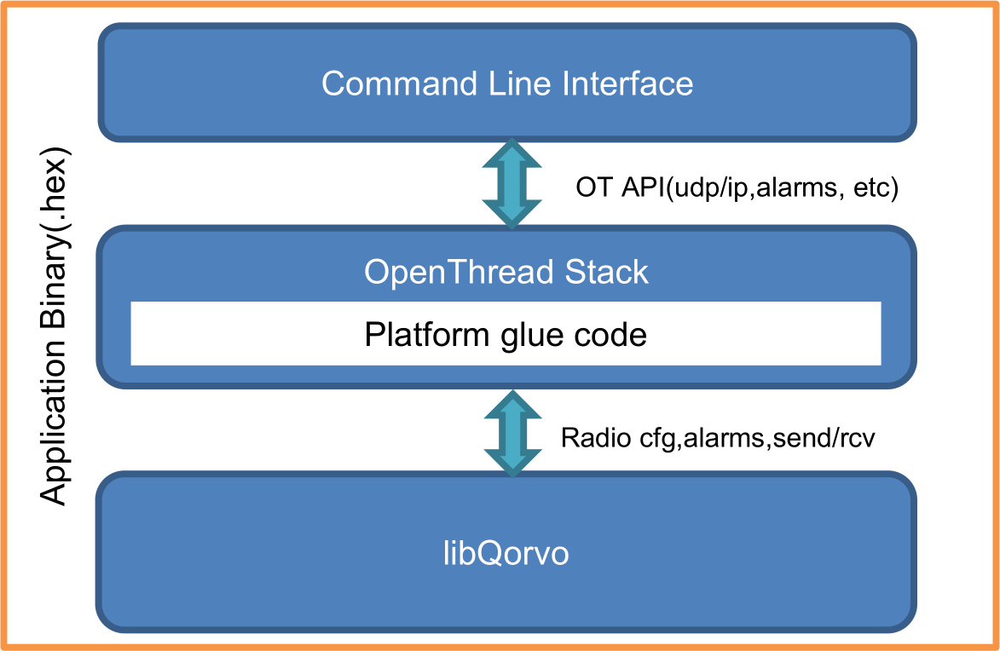

# QPG6100 User Manual

*OpenThread* is an open source implementation of Thread networking protocols developed by the Thread group. It allows 802.15.4-capable devices to build robust dynamic mesh networks.
This document provides the reader with instructions on how to run a Thread application using the *OpenThread* stack with the QPG6100.

The QPG6100 ([specification](https://www.qorvo.com/products/p/QPG6100)) is a multi-standard Smart Home Communications Controller featuring Dynamic Multi-Protocol and ConcurrentConnect™ technology. This enables Bluetooth® Low Energy, Zigbee® and Thread to operate simultaneously in a single chip design.  
ConcurrentConnect™ technology: allowing instantaneous switching between Bluetooth Low Energy and IEEE 802.15.4 protocols with no observable blind spots.

---

- [QPG6100 User Manual](#qpg6100-user-manual)
  - [Prerequisites](#prerequisites)
    - [Hardware](#hardware)
    - [Software](#software)
  - [Building *OpenThread*](#building-openthread)
    - [Architecture](#architecture)
    - [Getting Qorvo *OpenThread*](#getting-qorvo-openthread)
    - [Command Line Interface (CLI) build for the QPG6100](#command-line-interface-cli-build-for-the-qpg6100)
  - [Programming the QPG6100](#programming-the-qpg6100)
  - [Interacting with the Thread Network through the CLI](#interacting-with-the-thread-network-through-the-cli)
  - [Additional resources](#additional-resources)

---

## Prerequisites

### Hardware

A QPG6100 development board and a standard USB A to USB B mini cable. Both are included in the QPG6100 Development Kit.

### Software

Currently *OpenThread* can only be built using a Unix based system. In this manual we will use a *Debian* based environment (as does *OpenThread*)

Make sure the package repositories are up date

    sudo apt-get update

Next install *Git*

    sudo apt-get install git -y

The *OpenThread* git repository comes with its own scripting to install required packages. This scripting will also install a version of the *arm-gcc-embedded toolchain*. However, what follows has been tested with version `9-2019-q4`. Get it from the [ARM website](https://developer.arm.com/tools-and-software/open-source-software/developer-tools/gnu-toolchain/gnu-rm/downloads) or through this [direct link](https://armkeil.blob.core.windows.net/developer/Files/downloads/gnu-rm/9-2019q4/gcc-arm-none-eabi-9-2019-q4-major-x86_64-linux.tar.bz2).

## Building *OpenThread*

### Architecture

On the QPG6100, we distinguish 4 levels.

From top to bottom:  
**Note:** paths are relative to the [root of the ot-qorvo repository](https://github.com/openthread/ot-qorvo)

- The Application:  
  - location: [`openthread/example/apps`](https://github.com/openthread/openthread/tree/main/examples/apps)
  - what: For this example the *OpenThread CLI* application will be built. This application allows the manipulation of the Thread stack over a serial interface.
- OpenThread Stack:
  - location: [`openthread/src/`](https://github.com/openthread/openthread/tree/main/src)
  - what: implements the [Thread specification](https://www.threadgroup.org/ThreadSpec). It can be configured through a set of [configure switches](https://github.com/openthread/openthread/tree/master/examples/common-switches.mk).
- Platform glue code:
  - location: [`src/qpg6100`](https://github.com/openthread/ot-qorvo/tree/main/src/qpg6100)
  - what: code to interface *OpenThread* with platform specific things such as alarms, storage, random number generator, …
- Drivers
  - location: [`third_party/Qorvo/repo/qpg6100`](https://github.com/Qorvo/qpg-openthread/tree/master/qpg6100), but hosted in a [Qorvo repository](https://github.com/Qorvo/qpg-openthread)
  - what: Qorvo specific code and libraries required to build for and interface with the QPG6100 platform.  
  - specifically (relative to *location*):
    - `ld/qpg6100.ld`: linker script for the QPG6100
    - `lib/libQorvoQPG6100_ftd.a`: library for *Full Thread Device* support
    - `lib/libQorvoQPG6100_mtd.a`: library for *Minimal End Device* support
    - `lib/libmbedtls_alt.a`: hardware support for cryptographic operations

All the above will be compiled into a single executable `.hex` file.

**Note:** the `_mtd.hex` executable can mimic sleepy behavior, but will not actually go to sleep. To get a `lib/libQorvoQPG6095_mtd_sleep.a` library, [contact us](#additional-resources).

### Getting Qorvo *OpenThread*

First get the latest version of *ot-qorvo* and its submodules

    git clone https://github.com/openthread/ot-qorvo
    cd ot-qorvo
    git submodule update --init --recursive

The `git submodule update` command will populate the `openthread` directory with the openthread core implementation and `third_party/Qorvo/repo` with pre-compiled libraries and the necessary linker scripts.

All commands and scripts are run from the openthread root directory.

To resolve any outstanding dependencies to build *OpenThread*, run the optional

    ./script/bootstrap

**Note 1:** The script will install a *gnu embedded toolchain*, but the one in [Prerequisites](#prerequisites) will be used in this example.  
**Note 2:** The final step of this script will fail if _Linuxbrew_ is not installed. The error can be ignored.

### Command Line Interface (CLI) build for the QPG6100

This is the most common build. It enables the user to control the thread stack parameters, to join/commission devices, etc. by connecting to a Command Line Interface (CLI) server accessible over UART.

First, add the compiler to `$PATH`

    export PATH=<path-to-toolchain>/9_2019-q4-major/bin/:$PATH

The basic build command for the QPG6100 is:

    ./script/build qpg6100

This will build the CLI application for both the *Minimal Thread Device* and the *Full Thread Device* simultaneously. The output will be the following `.hex` files located in `./build/bin`

- `qpg6100-ot-cli-ftd.hex`
- `qpg6100-ot-cli-mtd.hex`

*OpenThread* provides a series of configuration switches to enable additional functionality in the build. For a list of the regular and the advanced features we refer you to [common-switches.mk](https://github.com/openthread/openthread/tree/master/examples/common-switches.mk) and the enhanced feature menu on the [build instructions landing page](https://openthread.io/guides/build), respectively.

For a *FTD* the following build command can be used

    ./script/build qpg6100 -DOT_COMMISSIONER=1 -DOT_DHCP6_CLIENT=1 -DOT_DHCP6_SERVER=1 -DOT_JOINER=ON

For a *MTD*, the following is sufficient

    ./script/build qpg6100 -DOT_DHCP6_CLIENT=1 -DOT_JOINER=ON

**Note:** both the above command will always build both the *FTD* and *MTD* executable. But it is unnecessary for a *MTD* device to support e.g. the *Commissioner* role or the DHCP server functionality.

## Programming the QPG6100

When inserting the USB cable into your build machine a *DAPLINK* should appear. Drag and drop the `.hex` output file to the *DAPLINK* drive and wait \~30sec. The QPG6100 will reprogram itself, unmount and remount itself on your host, if the programming succeeded, there should be no `FAIL.txt` file on the remounted drive.

Alternative ways, such as using a J-Link, to program the QPG6100 are outlined in the documentation package that comes with the QPG6100 Development Kit.

## Interacting with the Thread Network through the CLI

Start with a QPG6100 board with the `qpg6100-ot-cli-ftd.hex` programmed. The device can be communicated with over a serial connection (`COMx` on Windows, `/dev/ttyACMx` on Unix) with the following parameters:

> - Speed: 115200
> - Data bits: 8
> - Stop bits: 1
> - Parity: None
> - Flow control: XON/XOFF

Validating the Thread operation can be done by running the scenarios [here](../../general/thread_validation.md).

## Additional resources

Please visit [www.qorvo.com](https://www.qorvo.com) for more information on our product line, or more specifically the [QPG6100 product page](https://www.qorvo.com/products/p/QPG6100) or contact us at
<LPW.support@qorvo.com>.

Additional generic information can be found on

- <https://github.com/openthread/openthread>
- <https://openthread.io>
- <https://groups.google.com/g/openthread-users>
